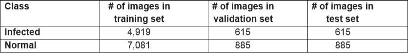

# COVID-19 Detection via X-Ray images
## Description
This repository contains code and results for COVID-19 classification assignment by Deep Learning Spring 2020 course offered at Information Technology University, Lahore, Pakistan. This assignment is only for learning purposes and is not intended to be used for clinical purposes.

## Dependencies
```python
import torch
import torch.nn as nn
import torch.optim as optim
from torch.optim import lr_scheduler
from torch.autograd import Variable
import numpy as np
import torchvision
from torchvision import datasets, models, transforms
import matplotlib.pyplot as plt
import time
import os
import copy
```

## Dataset
For the task at hand we have used an open source data set of X-Ray images [Dataset](https://drive.google.com/drive/u/1/folders/1-FzZhQO9oHIT9SNOWYoKsuz7fe447vtR)\
In this data set we have divided our data into 3 categories:
```python
1. Train data
2. Test data
3. Validation data
```
Follwing are the details of Data set: \



Chest X-Ray images are taken in different views (AP or PA) depending on which side of the body is facing the X-Ray scanner. Images from different views have slightly different features. For this task, we will be using images without considering their views. A few sample images: \
