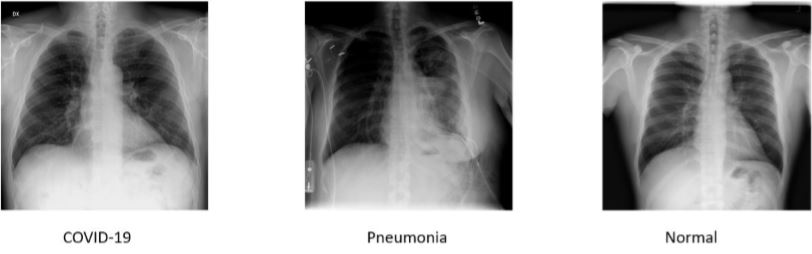

# COVID-19 Detection via X-Ray images
## Description
This repository contains code and results for COVID-19 classification assignment by Deep Learning Spring 2020 course offered at Information Technology University, Lahore, Pakistan. This assignment is only for learning purposes and is not intended to be used for clinical purposes.

## Dependencies
```python
import torch
import torch.nn as nn
import torch.optim as optim
from torch.optim import lr_scheduler
from torch.autograd import Variable
import numpy as np
import torchvision
from torchvision import datasets, models, transforms
import matplotlib.pyplot as plt
import time
import os
import copy
```

## Dataset
For the task at hand we have used an open source [data set](https://drive.google.com/drive/u/1/folders/1-FzZhQO9oHIT9SNOWYoKsuz7fe447vtR) of X-Ray images <br>
In this data is divided into 3 categories:
```python
1. Train data
2. Test data
3. Validation data
```
Follwing are the details of Data set: <br>


Chest X-Ray images are taken in different views (AP or PA) depending on which side of the body is facing the X-Ray scanner. Images from different views have slightly different features. For this task, we will be using images without considering their views. A few sample images: <br><br>



## Experiments Performed
Case|Model|CNN layers|FC layers
-----|-----|----------|---------|
----------|----------|requires_grad|requires_grad
case1|VGG-16|all False|all True
case2|ResNet-18|all False|all True
case3|VGG-16|some False|all True
case4|ResNet-18|some False|all True
case5|VGG-16|all True|all True
case6|ResNet-18|all True|all True

<!--```python
1. Transfer learning on VGG-16 trained for ImageNet by freezing all CNN layers and replacing FC layers with new FC layers.
2. Transfer learning on ResNet-18 trained for ImageNet by freezing all CNN layers and replacing FC layers with new FC layers.
3. Transfer learning on VGG-16 trained for ImageNet by freezing some CNN layers and replacing FC layers with new FC layers.
4. Transfer learning on ResNet-18 trained for ImageNet by freezing some CNN layers and replacing FC layers with  new FC layers.
5. Transfer learning on VGG-16 trained for ImageNet by unfreezing all layers and replacing FC layers with new FC layers.
```-->
<br>

## Classification Results
<br>

```python
CASE 1
```
**Accuracy**
Data Split|Accuracy
-|-|
test data|94%
train data|88.81
validation data|88.26

**Confusion Matrix Training data**
N|prediction(infected)|predicted(normal)
---------|---------|---------|
actual(infected)|3901|1018|
actual(normal)|287|5565|

<br>

**Confusion Matrix Validation data**
N|prediction(infected)|predicted(normal)
---------|---------|---------|
actual(infected)|510|105|
actual(normal)|71|814|

<br>

**Confusion Matrix Testing data**
N|prediction(infected)|predicted(normal)
---------|---------|---------|
actual(infected)|553|62|
actual(normal)|17|868|

<br>

```python
CASE 2
```

**Accuracy**
Data|Accuracy
---------|---------|
test data|93%
train data|85.99
validation data|86.53

**Confusion Matrix Training data**
N|prediction(infected)|predicted(normal)
---------|---------|---------|
actual(infected)|4220|699|
actual(normal)|737|5115|

<br>

**Confusion Matrix Validation data**
N|prediction(infected)|predicted(normal)
---------|---------|---------|
actual(infected)|548|67|
actual(normal)|135|750|

<br>

**Confusion Matrix Testing data**
N|prediction(infected)|predicted(normal)
---------|---------|---------|
actual(infected)|566|49|
actual(normal)|56|829|

<br>

```python
CASE 3
```

**Accuracy**
Data|Accuracy
---------|---------|
test data|93%
train data|85.99
validation data|86.53

**Confusion Matrix Training data**
N|prediction(infected)|predicted(normal)
---------|---------|---------|
actual(infected)|-1|-1|
actual(normal)|-1|-1|

<br>

**Confusion Matrix Validation data**
N|prediction(infected)|predicted(normal)
---------|---------|---------|
actual(infected)|-1|-1|
actual(normal)|-1|-1|

<br>

**Confusion Matrix Testing data**
N|prediction(infected)|predicted(normal)
---------|---------|---------|
actual(infected)|-1|-1|
actual(normal)|-1|-1|

<br>

```python
CASE 4
```

**Accuracy**
Data|Accuracy
---------|---------|
test data|93%
train data|85.99
validation data|86.53

**Confusion Matrix Training data**
N|prediction(infected)|predicted(normal)
---------|---------|---------|
actual(infected)|-1|-1|
actual(normal)|-1|-1|

<br>

**Confusion Matrix Validation data**
N|prediction(infected)|predicted(normal)
---------|---------|---------|
actual(infected)|-1|-1|
actual(normal)|-1|-1|

<br>

**Confusion Matrix Testing data**
N|prediction(infected)|predicted(normal)
---------|---------|---------|
actual(infected)|-1|-1|
actual(normal)|-1|-1|

<br>

```python
CASE 5
```

**Accuracy**
Data|Accuracy
---------|---------|
test data|93%
train data|85.99
validation data|86.53

**Confusion Matrix Training data**
N|prediction(infected)|predicted(normal)
---------|---------|---------|
actual(infected)|-1|-1|
actual(normal)|-1|-1|

<br>

**Confusion Matrix Validation data**
N|prediction(infected)|predicted(normal)
---------|---------|---------|
actual(infected)|-1|-1|
actual(normal)|-1|-1|

<br>

**Confusion Matrix Testing data**
N|prediction(infected)|predicted(normal)
---------|---------|---------|
actual(infected)|-1|-1|
actual(normal)|-1|-1|

<br>

```python
CASE 6
```

**Accuracy**
Data|Accuracy
---------|---------|
test data|96%
train data|91.57
validation data|86.53

**Confusion Matrix Training data**
N|prediction(infected)|predicted(normal)
---------|---------|---------|
actual(infected)|4178|741|
actual(normal)|194|5658|

<br>

**Confusion Matrix Validation data**
N|prediction(infected)|predicted(normal)
---------|---------|---------|
actual(infected)|535|80|
actual(normal)|59|826|

<br>

**Confusion Matrix Testing data**
N|prediction(infected)|predicted(normal)
---------|---------|---------|
actual(infected)|575|40|
actual(normal)|15|870|

<br>
